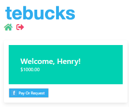
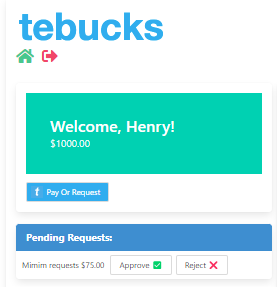

# Module 2 Capstone - TEBucks

Congratulations—you've landed a job with TEBucks, whose product is an online payment service for transferring "TE bucks" between friends. However, they don't have a product yet. You've been tasked with writing a RESTful API server and command-line application.

The frontend of TEBucks has been completed for you, and it is hosted at https://tebucks.netlify.app/
Your job is to complete the backend, including the Web API and database.

The frontend team has provided the API design for you, which can be found further down in the README.
You must adhere to this design in order for the frontend to work with your backend.
You can and will need to add to the provided models, but do not take away fields that were provided as the
frontend relies on these field names and data types.

## Use cases

1. **[COMPLETE]** As a user of the system, I need to be able to register myself with a username and password.
    1. The ability to register has been provided in your starter code.
2. **[COMPLETE]** As a user of the system, I need to be able to log in using my registered username and password.
    1. Logging in returns an Authentication Token. I need to include this token with all my subsequent interactions with the system outside of registering and logging in.
    2. The ability to log in has been provided in your starter code.
3. A newly registered user should start with an initial balance of 1,000 TE Bucks.
4. As an authenticated user of the system, I need to be able to see my Account Balance.
5. As an authenticated user of the system, I need to be able to *send* a transfer of a specific amount of TE Bucks to a registered user.
    1. I should be able to choose from a list of users to send TE Bucks to.
    2. A transfer includes the User IDs of the from and to users and the amount of TE Bucks.
    3. The receiver's account balance is increased by the amount of the transfer.
    4. The sender's account balance is decreased by the amount of the transfer.
    5. I can't send more TE Bucks than I have in my account.
    6. I can't send a zero or negative amount.
    7. I must not be allowed to send money to myself.
    8. A Sending Transfer has an initial status of *Approved*.
6. As an authenticated user of the system, I need to be able to see transfers I have sent or received.
7. As an authenticated user of the system, I need to be able to retrieve the details of any transfer based upon the transfer ID.
8. As an authenticated user of the system, I need to be able to *request* a transfer of a specific amount of TE Bucks from another registered user.
    1. I should be able to choose from a list of users to request TE Bucks from.
    2. I must not be allowed to request money from myself.
    3. I can't request a zero or negative amount.
    4. A transfer includes the User IDs of the from and to users and the amount of TE Bucks.
    5. A Request Transfer has an initial status of *Pending*.
    6. No account balance changes until the request is approved.
    7. The transfer request should appear in both users' list of transfers (use case #7).
9. As an authenticated user of the system, I need to be able to see my *Pending* transfers.
10. As an authenticated user of the system, I need to be able to either approve or reject a Request Transfer.
    1. I can't "approve" a given Request Transfer for more TE Bucks than I have in my account.
    2. The Request Transfer status is *Approved* if I approve, or *Rejected* if I reject the request.
    3. If the transfer is approved, the requester's account balance is increased by the amount of the request.
    4. If the transfer is approved, the requestee's account balance is decreased by the amount of the request.
    5. If the transfer is rejected, no account balance changes.
11. As a Tech Elevator Banking System, I need to log specific transactions with the Tech Elevator Aberrant Revenue Service (TEARS).
    1. Login to TEARS using the `/login` endpoint. This endpoint will return a JWT token, which will be used in all subsequent requests to log information.
    2. I must log any transfer of at least $1,000 TE Bucks or more.
    3. I must log any transfer attempt that would result in an overdraft.

## Prepare your TEARS Account
In order to communicate with TEARS, you need to create an account with a username and password. Create your user account for TEARS using Postman and the registration endpoint `/register`, be sure to record your username and password. The full documentation for the TEARS API is located at https://tears.azurewebsites.net/.

## Sample screens

### Use case 4: Current balance


### Use case 5: Send TE Bucks


### Use case 6: View transfers


### Use case 7: Transfer details


### Use case 8: Requesting TE Bucks


### Use case 9: Pending requests


### Use case 10: Approve or reject pending transfer


## How to set up the database


Create a new Postgres database called `tebucks`. Run the `database/tebucks.sql` script in pgAdmin to set up the database.

The very first task that you should complete after digesting the requirements is to build the remainder of database. Add the tables and data necessary for completing this project to the `database/tebucks.sql` script. Rerun the `database/tebucks.sql` script whenever would like to apply your changes.

### Datasource

A Datasource has been configured for you in `/src/resources/application.properties`.

```
# datasource connection properties
spring.datasource.url=jdbc:postgresql://localhost:5432/tebucks
spring.datasource.name=tebucks
spring.datasource.username=postgres
spring.datasource.password=postgres1
```

### JdbcTemplate

If you look in `/src/main/java/com/techelevator/tebucks/security/dao`, you'll see `JdbcUserDao`. This is an example of how to get an instance of `JdbcTemplate` in your DAOs. If you declare a field of type `JdbcTemplate` and add it as an argument to the constructor, Spring automatically injects an instance for you:

```java
@Component
public class JdbcUserDao implements UserDao {

    private JdbcTemplate jdbcTemplate;

    public JdbcUserDao(JdbcTemplate jdbcTemplate) {
        this.jdbcTemplate = jdbcTemplate;
    }
}
```

## Testing


### DAO integration tests

`com.techelevator.tebucks.dao.BaseDaoTests` has been provided for you to use as a base class for any DAO integration test. It initializes a Datasource for testing and manages rollback of database changes between tests.

`com.techelevator.tebucks.dao.JdbUserDaoTests` has been provided for you as an example for writing your own DAO integration tests.

Remember that when testing, you're using a copy of the real database. The schema and data for the test database are defined in `/src/test/resources/test-data.sql`. The schema in this file matches the schema defined in `database/tebucks.sql`.

## API design
Provided

| Request Method | Path      | Request Body    | Returns          |
|----------------|-----------|-----------------|------------------|
| POST           | /login    | LoginDto        | LoginResponseDto |
| POST           | /register | RegisterUserDto | void             |


For you to complete

| Request Method | Path                       | Request Body            | Returns         |
|----------------|----------------------------|-------------------------|-----------------|
| GET            | /api/account/balance       | N/A                     | Account      |
| GET            | /api/account/transfers     | N/A                     | List\<Transfer> |
| GET            | /api/transfers/{id}        | N/A                     | Transfer        |
| POST           | /api/transfers             | NewTransferDto          | Transfer        |
| PUT            | /api/transfers/{id}/status | TransferStatusUpdateDto | Transfer        |
| GET            | /api/users                 | N/A                     | List\<User>     |

LoginDto
```
{
    "username" : "A string to hold the user's name",
    "password" : "A string containing the password"
}
```
LoginResponseDto
```
{
    "token" : "A string holding the JWT for the user",
    "user" : "An object representing the user"
}
```
RegisterUserDto
```
{
    "firstname" : "A string to hold the user's first name",
    "lastname" : "A string to hold the user's last name",
    "username" : "A string to hold the user's name",
    "password" : "A string containing the password"
}
```
Account
```
{
    "accountId" : "An integer holding the account id",
    "userId" : "An integer holding the user's id",
    "balance" : "A floating point value holding the account balance"
}
```
Transfer
```
{
    "transferId" : "An integer holding the transfer id",
    "transferType" : "A string for the transfer type: Send or Request",
    "transferStatus" : "A string for the transer status: Pending, Approved, or Rejected",
    "userFrom" : "A user object representing the user who is transfering the money",
    "userTo" : "A user object representing the user receiving the transfered money",
    "amount" : "A floating point value indicating the amount to transfer"
}
```
NewTransferDto
```
{
    "userFrom" : "An integer holding the id for the user that is transfering the money",
    "userTo" : "An integer holding the id for the user that is receiving the money",
    "amount" : "A decimal indicating the amount to transfer",
    "transferType" : "A string for the transfer type: Send or Request",
}
```
TransferStatusUpdateDto
```
{
    "transferStatus" : "A string for the transer status: Pending, Approved, or Rejected"
}
```
